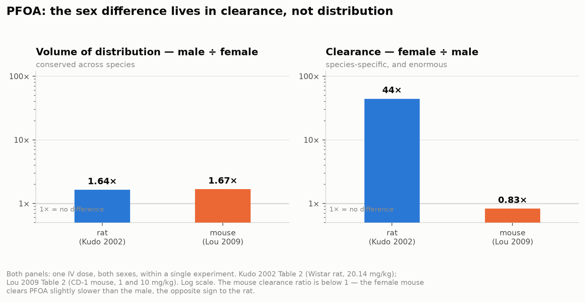
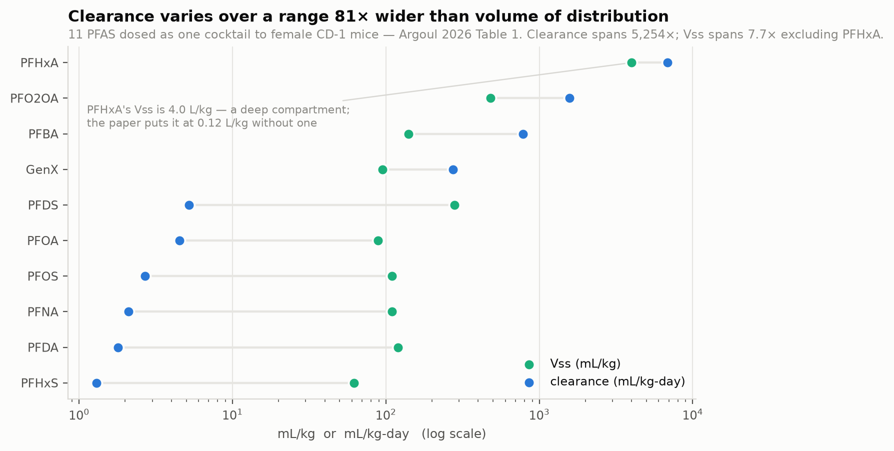
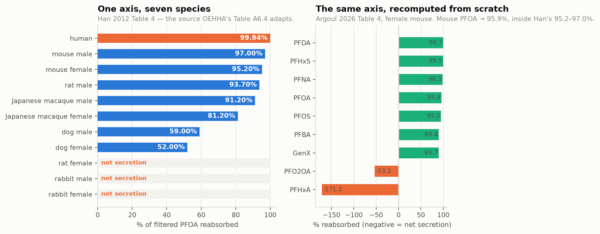
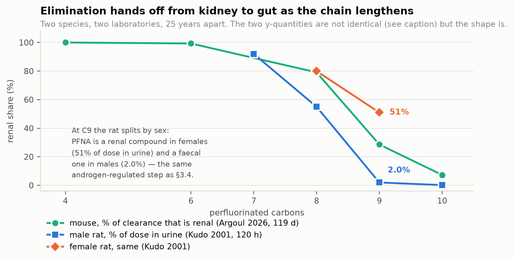
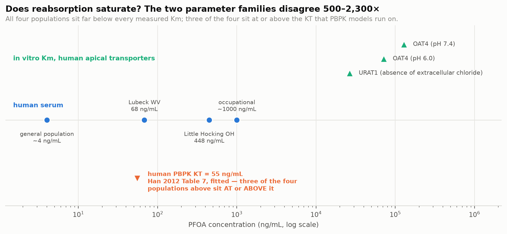
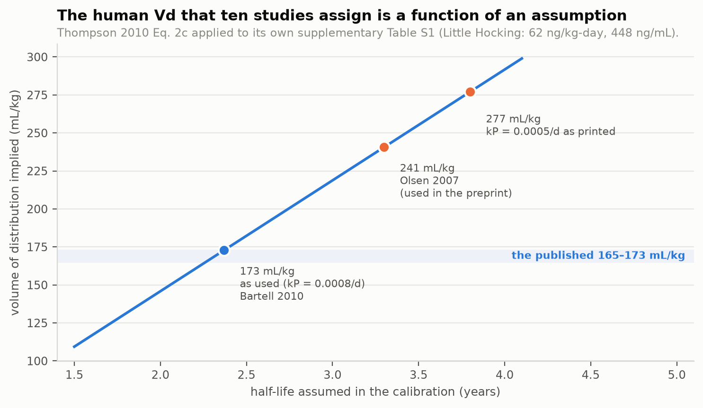

# PFAS toxicokinetics: what the primary sources say

A standalone summary of the review in `report/REPORT.md`, built after twenty-one
previously unobtainable full texts were supplied. Every figure is reproducible
from `scripts/`; every number traces to a table in a paper named in the
citations at the end.

**The question.** Why do PFAS serum half-lives differ so much between humans,
rats and mice; what did each reported half-life assume; and is exposure level
related to half-life or to volume of distribution?

---

## The one equation everything hangs on

```
t½ = ln2 · Vd / CL
```

Half-life is not an independent property. It is a ratio of two things — how
much of the body the chemical occupies, and how fast the body removes it. Any
two of the three fix the third. Almost every disagreement in this literature is
a disagreement about which two were measured and which one was assumed.

---

## 1. The species difference is a clearance difference, and a female one



Six datasets measure *both* terms in *both* sexes inside single experiments —
three species, two compounds, four laboratories — so this needs no cross-study
comparison at all:

| dataset | compound | Vd M/F | clearance F/M |
|---|---|---|---|
| rat (Kudo 2002) | PFOA | 1.64× | **44.3×** |
| rat (Sundström 2012) | PFHxS | 2.18× | **7.95×** |
| monkey (Sundström 2012) | PFHxS | 1.35× | 1.45× |
| mouse (Lou 2009) | PFOA | 1.67× | **0.83×** |
| mouse, 1 mg/kg (Sundström 2012) | PFHxS | 1.34× | **0.91×** |
| mouse, 20 mg/kg (Sundström 2012) | PFHxS | 1.33× | **0.78×** |

**Vd male/female spans 1.33–2.18× — a 1.6× spread. Clearance female/male spans
0.78–44.3× — a 56× spread.** The Vd ratio is male-higher every single time and
never leaves a narrow band. The clearance ratio ranges over nearly two orders of
magnitude and changes sign between species. Sundström's authors reach the
distribution half of this independently, noting that in all three species "the
mean Vdss suggested predominantly extracellular distribution".

For PFOA the half-life split works out at **89% clearance / 11% Vd** in the rat
and **26% / 74%** in the mouse — where the clearance difference nearly vanishes,
what remains is the conserved Vd term. Vd matters only where clearance does not.

**The mouse's inverted sex difference is real.** All three mouse clearance ratios
sit below 1 (0.83, 0.91, 0.78), across two compounds and two laboratories. The
female mouse genuinely clears these compounds slightly *more slowly* than the
male — the opposite sign to the rat, and not sampling noise around unity.

Taking both limbs from primary sources, the species gap is concentrated in
females:

| PFOA clearance | rat | mouse | ratio |
|---|---|---|---|
| **female** | 2,233 mL/kg-day | 4.5–6.0 | **373–496×** |
| **male** | 50.4 mL/kg-day | 7.2 | **7.0×** |

**The same structure appears in a second compound.** Tatum-Gibbs 2011 is the
only strain-matched rat-vs-mouse PFNA experiment: rat half-life 30.6 d male
against 1.4 d female (**21.9×**), mouse 34.3–68.9 d male against 25.8–68.4 d
female (**~1×**). Large rat sex difference, absent mouse sex difference, species
gap concentrated in females — the identical pattern, with the strain confound
removed.

---

## 2. Distribution is not where the action is



Argoul 2026 dosed 11 PFAS as a single cocktail to one sex of one strain, so
strain, timing, assay and model are held constant. Across those 11 compounds
**clearance spans 5,254× while Vss spans 7.7×**. The one exception, PFHxA at
4.0 L/kg, is a deep peripheral compartment the authors say would otherwise read
0.12 L/kg.

This is the same conclusion the review reached across studies (Vd r = +0.00 with
the half-life gap, clearance r = +0.87), now with every cross-study confound
removed.

---

## 3. One mechanistic axis: fractional renal reabsorption



```
CL_renal = fu · GFR · (1 − FR)
```

Han 2012 Table 4 — the source OEHHA's Table A6.4 adapts — orders seven species
on the reabsorbed fraction, from human 99.94% down through mouse, male rat,
macaque and dog, with the female rat and rabbit in **net secretion**. The axis
reproduces rodent half-lives within 1.7× over a 37× span with no free
parameters.

Argoul 2026's Table 4 lets that be recomputed from scratch for ten compounds in
mice. **Mouse PFOA comes out at 95.9%, inside Han's 95.2–97.0%**, from an
unrelated laboratory and dataset. Two compounds fall past zero into net
secretion, so that end of the axis is not a female-rat peculiarity.

**But the axis has two factors, and the review previously treated it as one.**
Humans have the longest half-life yet reabsorb *less* PFOA in absolute terms
(51 mL/d/kg) than male rats (270) or mice (318–324). What is extreme about
humans is the fraction. Decomposing the 333× male-mouse-to-human renal clearance
gap:

| factor | contribution | basis |
|---|---|---|
| escape fraction (1 − FR) | **50×** | 3.0% escapes in mouse vs 0.06% in human |
| filtration term (fu · GFR) | **6.5×** | GFR 16.7 vs 2.57 L/d/kg |

68% and 32% on a log scale. Reabsorption is the larger term — which is why the
single-axis framing works — but a third of the human/rodent difference is simply
that humans filter blood six times more slowly per kg.

### Which transporter, and a species surprise

A candidate must be *both* sex-divergent *and* able to carry PFOA:

| transporter | rat sex difference (Kudo 2002) | transports PFOA? | verdict |
|---|---|---|---|
| Oat1 | none | yes, Km 43.2 µM | transports, not sex-divergent |
| Oat3 | none | yes | transports, not sex-divergent |
| Oat2 | **7.5× female** | **no** (Weaver 2010 Fig. 9A) | sex-divergent, cannot carry it |
| OAT-K | 2.5× male | untested | untested |
| **Oatp1a1** | **23× male**, androgen-induced | **yes**, C8–C10 | **the only one meeting both** |

That 23× also resolves a contradiction: EPA's PFHxA review quotes the rat
male/female Oatp1a1 mRNA ratio as 2.5-fold, which is in fact this paper's
**OAT-K** value, a different transporter.

**And the mouse direction is settled too.** Cheng 2005 states twice — abstract
and Discussion — that mouse renal Oatp1a1 is higher in males, that it sits on
the apical membrane of the proximal tubule "where it reabsorbs organic anions
from the lumen", and that the male predominance is androgen-dependent.
Cheng 2006's abstract calls renal Oatp1a1 "female-predominant", but the same
abstract then reports that "androgens increased Oatp1a1 mRNA in liver and
kidney" and concludes that renal gender-divergence is "exclusively caused by
stimulation by androgens" — so that one clause contradicts its own results, its
own conclusion, and the 2005 paper it cites. Mouse renal Oatp1a1 is
male-predominant and androgen-driven, which deepens the mouse puzzle rather
than solving it: the same regulation, no PFOA sex difference.

**The human reabsorptive transporter is not the rat's.** Yang 2010 found that
**OATP1A2 — the closest human orthologue of rat Oatp1a1 — does not mediate
saturable PFOA uptake at all.** Human apical reabsorption runs through OAT4
(Km 172–310 µM) and URAT1, neither androgen-regulated. The reabsorbed *fraction*
transfers across species; the *mechanism* does not. That is a reason to expect
what the epidemiology shows — no human sex difference of the rat's kind.

---

## 4. Elimination hands off from kidney to gut as the chain lengthens



Kudo 2001 (rat, 1998 data) and Argoul 2026 (mouse, 2026) agree, 25 years apart
in different laboratories: the renal share falls monotonically with chain
length, and the gut takes over for C9–C10. In the rat the hand-off is also
sex-dependent — female rats put 51% of a PFNA dose in urine against the male's
2.0%, so C9 is a renal compound in females and a faecal one in males.

Any human clearance accounting that assigns a single route fraction across
compounds is wrong in a predictable direction.

---

## 5. Does exposure relate to half-life or to Vd? No, on both counts

- **Vd does not track dose.** Slopes run −0.21 to +0.25 with inconsistent sign.
- **Half-life is nearly dose-independent.** Four independent dose slopes cluster
  at +0.08 to +0.12 against a ceiling of 1. The one real exception is the female
  rat, slope +0.21 over a 3,200× dose range (saturable secretion); the male rat
  is −0.02.
- **The between-person association does not survive age adjustment** (Li 2022,
  re-run).



**But the basis for "saturation is unreachable" is narrower than it looks.** On
every in vitro measurement, human serum sits 26–6,600× below the lowest
transporter Km. On the KT values that published PBPK models actually run on
(Han 2012 Table 7, human KT = 0.133 µM), three of four human populations sit
*at or above* half-saturation — the opposite conclusion, from the same
literature, with the two parameter families 483–2,336× apart.

The in vitro side should be believed: the KT values are fitted, not measured;
two rows in Han's own table marked "derived from an in vitro measurement" carry
a KT ~1,200× higher; the mouse row (Lou 2009) has standard errors exceeding its
estimates; and the dose-response evidence agrees with the in vitro side. But the
honest statement is that **nobody has measured a human KT.**

---

## 6. The human volume of distribution is an assumption, not a measurement



Nine of 42 adopted regulatory clearance factors are computed from Thompson
2010's 170 mL/kg, and EPA's own Table B-26 shows ten human studies *assigning*
it. The full text settles what it is.

Its supplementary Table S1 is headed *"Input data for the **calibration** of the
Vd parameter"* with a final column headed **"calculated Vd"**. Applying the
paper's Eq. 2c, `Vd = DP/(CP·kP)`, with its assigned kP = 0.0008/day:

| community | dose | serum | computed here | published |
|---|---|---|---|---|
| Little Hocking | 62 ng/kg-day | 448 ng/mL | 173.0 mL/kg | 173 |
| Lubeck | 9 ng/kg-day | 68 ng/mL | 165.4 mL/kg | 165 |

Both reproduce exactly. The implied half-life is 2.37 years — taken from Bartell
2010, which the paper says it preferred *because Bartell measured it in the same
two communities*.

The consequence is sharper than "circular". When an agency forms
`CL = ln2·Vd/t½`, the half-life **cancels exactly**, leaving `CL = Dose/Serum =
0.132–0.138 mL/kg-day`. But Vd does not cancel — it is proportional to whatever
half-life is assumed, from 168 mL/kg at 2.3 y to 277 at 3.8 y. Adopting "170"
alongside a different half-life silently contradicts the data it came from. The
paper's own appended corrigendum is that error, corrected by a factor of 0.6 —
which is exactly the ratio of the two rate constants.

Two further findings: **PFOA = 170 and PFOS = 230** (Andersson 2025 transposes
them; Zhang 2013 has them right), and **the PFOS value was never calibrated
against any data** — it is 170 × 1.35, scaled on a cited monkey model.

Meanwhile all three direct human measurements — Andersson 74, Abraham 121,
Gasiorowski-derived 113–199 mL/kg — fall *below* the assigned range, while
Chiu's fitted 430 sits far above it.

---

## 7. What this review corrects in its own work

The CPHEA refits in `db/cphea_fitted_halflives.csv` were computed here by
selecting the terminal window with the best adjusted R². On a biphasic curve
that rule picks the shallow tail. Kudo 2002 makes it measurable, because CPHEA
study 2990271 *is* that experiment:

| | fitted here | published | ratio |
|---|---|---|---|
| female rat | 1.44 d | 0.08 d | **17.9×** |
| male rat | 8.08 d | 5.68 d | 1.4× |
| M/F ratio | 5.6× | **71×** | understated 13× |

The bias runs one way, compressing ratios toward 1, so every conclusion above
survives and several strengthen. But that column must not be read as comparable
to published half-lives; it now carries a `tail_selection_flag`. Argoul 2026
makes the same methodological point independently, preferring mean residence
time because "the terminal half-life does not reliably reflect the overall
persistence."

Full list of corrections, including three to EPA and OEHHA documents, in
`report/REPORT.md` §8.

---

## The datasets

| File | Rows | What it holds |
|---|---|---|
| `db/combined/tk_parameters.csv` | 746 | half-life, clearance, Vd, MRT, bioavailability, GFR and reabsorption, by chemical × species × sex × source, units normalised |
| `db/combined/binding.csv` | 198 | protein binding constants and unbound fractions, with the method for each |
| `db/combined/transporters.csv` | 275 | transporter Km, Tm/KT, mRNA sex ratios and direction |
| `db/combined/regulatory.csv` | 215 | what each agency adopted, from which study, under which assumptions |
| `db/combined/PFAS_TK_combined.xlsx` | — | all four as one workbook, filterable |

1,434 rows in total, 20 distinct chemicals, 8 species groups. Every row carries a `provenance` column
naming the file it came from and a `study` / `pmid_or_doi` / `source_table` trio
naming the primary source. Rebuild with
`python3 scripts/build_combined_datasets.py`.

The 20 per-paper extractions behind the newest findings are in
`db/primary_2026/`, one file per table per paper.

---

## Citations

### Primary toxicokinetic sources read in full for this summary

1. **Argoul CML, Toutain P-L, Picard-Hagen N, Mselli-Lakhal L, Dauwe Y, Roques BB, Lacroix MZ, Gayrard V** (2026). Nonlinear mixed-effects modeling of the intravenous and oral kinetics of eleven perfluoroalkyl substances in female mice. *Environmental Research* 303:124802. PMID 42162713. doi:10.1016/j.envres.2026.124802
2. **Han X, Nabb DL, Russell MH, Kennedy GL, Rickard RW** (2012). Renal elimination of perfluorocarboxylates (PFCAs). *Chemical Research in Toxicology* 25(1):35–46. PMID 21985250. doi:10.1021/tx200363w
3. **Kudo N, Suzuki E, Katakura M, Ohmori K, Noshiro R, Kawashima Y** (2001). Comparison of the elimination between perfluorinated fatty acids with different carbon chain length in rats. *Chemico-Biological Interactions* 134(2):203–216. PMID 11311214. doi:10.1016/s0009-2797(01)00155-7
4. **Kudo N, Katakura M, Sato Y, Kawashima Y** (2002). Sex hormone-regulated renal transport of perfluorooctanoic acid. *Chemico-Biological Interactions* 139(3):301–316. PMID 11879818. doi:10.1016/s0009-2797(02)00006-6
5. **Lou I, Wambaugh JF, Lau C, Hanson RG, Lindstrom AB, Strynar MJ, Zehr RD, Setzer RW, Barton HA** (2009). Modeling single and repeated dose pharmacokinetics of PFOA in mice. *Toxicological Sciences* 107(2):331–341. PMID 19005225. doi:10.1093/toxsci/kfn234
6. **Tatum-Gibbs K, Wambaugh JF, Das KP, Zehr RD, Strynar MJ, Lindstrom AB, Delinsky A, Lau C** (2011). Comparative pharmacokinetics of perfluorononanoic acid in rat and mouse. *Toxicology* 281(1–3):48–55. doi:10.1016/j.tox.2011.01.003
7. **Thompson J, Lorber M, Toms L-ML, Kato K, Calafat AM, Mueller JF** (2010). Use of simple pharmacokinetic modeling to characterize exposure of Australians to perfluorooctanoic acid and perfluorooctane sulfonic acid. *Environment International* 36(4):390–397. PMID 20236705. doi:10.1016/j.envint.2010.02.008 — with its **corrigendum**, *Environment International* 36(6):652. doi:10.1016/j.envint.2010.05.008
8. **Yang C-H, Glover KP, Han X** (2010). Characterization of cellular uptake of perfluorooctanoate via organic anion-transporting polypeptide 1A2, organic anion transporter 4, and urate transporter 1 for their potential roles in mediating human renal reabsorption of perfluorocarboxylates. *Toxicological Sciences* 117(2):294–302. PMID 20639259. doi:10.1093/toxsci/kfq219
9. **Sundström M, Chang S-C, Noker PE, Gorman GS, Hart JA, Ehresman DJ, Bergman Å, Butenhoff JL** (2012). Comparative pharmacokinetics of perfluorohexanesulfonate (PFHxS) in rats, mice, and monkeys. *Reproductive Toxicology* 33(4):441–451. PMID 21856411. doi:10.1016/j.reprotox.2011.07.004
10. **Cheng X, Maher J, Chen C, Klaassen CD** (2005). Tissue distribution and ontogeny of mouse organic anion transporting polypeptides (Oatps). *Drug Metabolism and Disposition* 33(7):1062–1073. PMID 15843488. doi:10.1124/dmd.105.003640
11. **Cheng X, Maher J, Lu H, Klaassen CD** (2006). Endocrine regulation of gender-divergent mouse organic anion-transporting polypeptide (Oatp) expression. *Molecular Pharmacology* 70(4):1291–1297. PMID 16807376. doi:10.1124/mol.106.025122 — *abstract only; the full text is paywalled.*
12. **Huang MC, Dzierlenga AL, Robinson VG, Waidyanatha S, DeVito MJ, Eifrid MA, Granville CA, Gibbs ST, Blystone CR** (2019). Toxicokinetics of perfluorobutane sulfonate, perfluorohexane-1-sulphonic acid, and perfluorooctane sulfonic acid in male and female Hsd:Sprague Dawley SD rats after intravenous and gavage administration. *Toxicology Reports* 6:645–655. PMID 31334035. doi:10.1016/j.toxrep.2019.06.016 — with its **corrigendum**, *Toxicology Reports* 8:365. PMID 33665134. doi:10.1016/j.toxrep.2021.02.001

13. **Han X, Snow TA, Kemper RA, Jepson GW** (2003). Binding of perfluorooctanoic acid to rat and human plasma proteins. *Chemical Research in Toxicology* 16(6):775–781. PMID 12807361. doi:10.1021/tx034005w
14. **Yang C-H, Glover KP, Han X** (2009). Organic anion transporting polypeptide (Oatp) 1a1-mediated perfluorooctanoate transport and evidence for a renal reabsorption mechanism of Oatp1a1 in renal elimination of perfluorocarboxylates in rats. *Toxicology Letters* 190(2):163–171. PMID 19616083. doi:10.1016/j.toxlet.2009.07.011
15. **Louisse J, Pedroni L, van den Heuvel JJMW, Rijkers D, Leenders L, Noorlander A, Punt A, Russel FGM, Koenderink JB, et al.** (2024). In vitro and in silico characterization of the transport of selected perfluoroalkyl carboxylic acids and perfluoroalkyl sulfonic acids by human organic anion transporter 1 (OAT1), OAT2 and OAT3. *Toxicology* 509:153961. doi:10.1016/j.tox.2024.153961
16. **Ohmori K, Kudo N, Katayama K, Kawashima Y** (2003). Comparison of the toxicokinetics between perfluorocarboxylic acids with different carbon chain length. *Toxicology* 184(2–3):135–140. PMID 12499116
17. **Cheng X, Klaassen CD** (2009). Tissue distribution, ontogeny, and hormonal regulation of xenobiotic transporters in mouse kidneys. *Drug Metabolism and Disposition* 37(11):2178–2185. PMID 19679677. doi:10.1124/dmd.109.027177
18. **Buist SCN, Klaassen CD** (2004). Rat and mouse differences in gender-predominant expression of organic anion transporter (Oat1–3; Slc22a6–8) mRNA levels. *Drug Metabolism and Disposition* 32(6):620–625. PMID 15155553. doi:10.1124/dmd.32.6.620
19. **Shi Y, Vestergren R, Xu L, Zhou Z, Li C, Liang Y, Cai Y** (2016). Human exposure and elimination kinetics of chlorinated polyfluoroalkyl ether sulfonic acids (Cl-PFESAs). *Environmental Science & Technology* 50(5):2396–2404. PMID 26866980. doi:10.1021/acs.est.5b05849
20. **Jia Y, Zhu Y, Xu D, Feng X, Yu X, Shan G, Zhu L** (2022). Insights into the competitive mechanisms of per- and polyfluoroalkyl substances partition in liver and blood. *Environmental Science & Technology* 56(10):6192–6200. PMID 35436088. doi:10.1021/acs.est.1c08493
21. **Maso L, Trande M, Liberi S, Moro G, Daems E, Linciano S, Sobott F, Covaceuszach S, Cassetta A, Fasolato S, Moretto LM, De Wael K, Cendron L, et al.** (2021). Unveiling the binding mode of perfluorooctanoic acid to human serum albumin. *Protein Science* 30(4):830–841. PMID 33550662. doi:10.1002/pro.4036
22. **Zurlinden TJ, Dzierlenga MW, Kapraun DF, Ring C, Bernstein AS, Schlosser PM, Morozov V** (2025). Estimation of species- and sex-specific PFAS pharmacokinetics in mice, rats, and non-human primates using a Bayesian hierarchical methodology. *Toxicology and Applied Pharmacology* 499:117336. doi:10.1016/j.taap.2025.117336

### Supporting primary sources held in full in `papers/`

23. **Weaver YM, Ehresman DJ, Butenhoff JL, Hagenbuch B** (2010). Roles of rat renal organic anion transporters in transporting perfluorinated carboxylates with different chain lengths. *Toxicological Sciences* 113(2):305–314. PMID 19915082. doi:10.1093/toxsci/kfp275
24. **Zhao W, Zitzow JD, Weaver Y, Ehresman DJ, Chang SC, Butenhoff JL, Hagenbuch B** (2017). Organic anion transporting polypeptides contribute to the disposition of perfluoroalkyl acids in humans and rats. *Toxicological Sciences* 156(1):84–95. PMID 28013215. doi:10.1093/toxsci/kfw236
25. **Abraham K, Mertens H, Richter L, Mielke H, et al.** (2024). Single oral dose of 15 PFAS in one adult volunteer; terminal half-lives, clearances and derived volumes of distribution. *Environment International*. PMID 39476597. doi:10.1016/j.envint.2024.109047
26. **Fischer FC, et al.** (2024). Protein binding of PFAS measured by solid-phase microextraction (C18 fibre depletion) at environmentally relevant PFAS:protein ratios. *Environmental Science & Technology*. doi:10.1021/acs.est.3c07415 — and **Fischer FC, et al.** (2025). doi:10.1021/acs.est.5c05473
27. **Andersson AG, et al.** (2025). The relative importance of fecal and urinary excretion of perfluorooctane sulfonic acid and perfluorooctanoic acid after high exposure — an observational study in Ronneby, Sweden. *Environmental Research* 285:122487. doi:10.1016/j.envres.2025.122487
28. **Li Y, Andersson A, Xu Y, Pineda D, Nilsson CA, Lindh CH, Jakobsson K, Fletcher T** (2022). Determinants of serum half-lives of PFAS after end of exposure to contaminated drinking water, Ronneby cohort. *(Held as structured abstract; the full text is paywalled and the title line was not captured verbatim.)*
29. **Chiu WA, et al.** (2022). Bayesian hierarchical pharmacokinetic modelling of PFAS in contaminated-water communities. *Environmental Health Perspectives*. doi:10.1289/EHP10103
30. **Zurlinden TJ, et al.** (2025). Estimation of species- and sex-specific PFAS pharmacokinetics in mice, rats, and non-human primates using a Bayesian hierarchical methodology. *(EPA CPHEA animal PFAS PK database.)*
31. **Louisse J, et al.** (2023). Perfluoroalkyl substances (PFASs) are substrates of the renal human organic anion transporter 4 (OAT4). *Archives of Toxicology*. PMID 36436016. doi:10.1007/s00204-022-03428-6

### Agency and regulatory documents

32. **US EPA** (2024). *Final Human Health Toxicity Assessment for Perfluorooctanoic Acid (PFOA)*, EPA-815R24006, and its Appendix (Table B-26).
33. **US EPA** (2024). *Final Human Health Toxicity Assessment for Perfluorooctane Sulfonic Acid (PFOS).*
34. **US EPA** (2025). *IRIS Toxicological Review of Perfluorohexanesulfonic Acid (PFHxS)*, Table 3-3.
35. **US EPA** (2023). *IRIS Toxicological Review of Perfluorohexanoic Acid (PFHxA).*
36. **California OEHHA** (2024). *Public Health Goals for PFOA and PFOS in Drinking Water*, Appendix Tables A6.3, A6.4 and 4.8.1.
37. **ATSDR** (2021). *Toxicological Profile for Perfluoroalkyls*, Tables 3-5 and 3-6.
38. **EFSA CONTAM Panel** (2020). *Risk to human health related to the presence of perfluoroalkyl substances in food*, Appendix C.
39. **New Jersey DWQI** (2017–2018). Health-based maximum contaminant level support documents for PFOA, PFOS and PFNA.

### Sources cited within the above and used as secondary attributions

Bartell et al. 2010 (*EHP* 118:222) for the PFOA half-life Thompson adopts;
Emmett et al. 2006 for the Little Hocking serum data; Olsen et al. 2007
(*EHP* 115:1298) for the occupational half-lives; Kemper 2003 (DuPont Haskell,
unpublished) for the rat PFOA dose series; Buist & Klaassen 2004
(*DMD* 32:620) for rat-vs-mouse Oat expression; Cheng & Klaassen 2005/2006/2009
for mouse Oatp regulation; Sundström et al. 2012 (PMID 21856411) for mouse PFHxS; Chang et al. 2012
(PMID 21889587) for PFOS across three species.

### Still not obtained

Hanhijärvi et al. 1988 (the entire dog column, a book chapter not in PubMed);
Kerstner-Wood 2003 (SRI contract report); Katakura et al. 2007 (not indexed
anywhere). See `WANTED.md` for the current list and what each would change.

---

*Generated from `report/REPORT.md` and the extractions in `db/`. Figures:
`scripts/make_figures.py` and `scripts/make_figures_primary.py`. Analyses:
`scripts/thompson_vd_circularity.py`, `primary_sex_species_decomposition.py`,
`argoul_reabsorption_check.py`, `han2012_axis_at_source.py`,
`saturation_margin_km_vs_kt.py`, `validate_cphea_fits.py`.*
